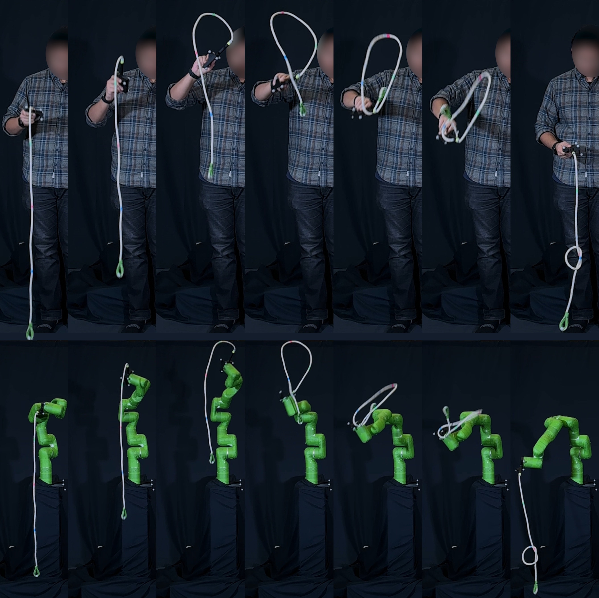

# flying-knots

Reference code for **"Learning Dynamic Rope Manipulation Using Task-Level Iterative Learning Control"**, by Krishna Suresh and Chris Atkeson (Carnegie Mellon University).

- 📄 **Paper:** [flying_knot_paper.pdf](https://arxiv.org/pdf/2602.21302)
- 🌐 **Project page:** <https://flying-knots.github.io>



## Abstract

> We introduce a Task-Level Iterative Learning Control method for dynamic manipulation of ropes. We demonstrate this method on a non-planar rope manipulation task called the *flying knot*. Using a single human demonstration and a simplified rope model, the method learns directly on hardware without reliance on large amounts of demonstration data or massive amounts of simulation. At each iteration, the algorithm inverts a model of the robot and rope by solving a quadratic program to propagate task-space errors into action updates. We evaluate performance across 7 different kinds of ropes, including chain, latex surgical tubing, and braided and twisted ropes, ranging in thicknesses of 7–25 mm and densities of 0.013–0.5 kg/m. Learning achieves a 100% success rate within 10 trials on all ropes. Furthermore, the method can successfully transfer between most rope types in 2–5 trials. <https://flying-knots.github.io>

## Repository layout

| Directory | Role |
|---|---|
| [`main/`](main/) | Workflow entry points: capture, clean, IK, learning, visualization |
| [`common/`](common/) | Shared utilities — data classes, mocap tracking, math, QP solver |
| [`simulation/`](simulation/) | Rope dynamics models (particle, Drake rigid-body, Elastica) and the ILC inverse model |
| [`xarm7/`](xarm7/) | xArm7 kinematics, hardware interface, and visualization |
| [`models/`](models/) | Robot URDF/SDF and rope/handle CAD assets |
| [`config/`](config/) | YAML configs for hardware, simulation, learning, and demos |
| [`docs/`](docs/) | Architecture overview and code-to-paper map |

For a detailed module-by-module walkthrough and a paper-to-code map, see [`docs/architecture.md`](docs/architecture.md).

## Workflow

The full learning pipeline is four stages. Each stage has a corresponding script in [`main/`](main/):

1. **Capture** — [`main/human_capture.py`](main/human_capture.py): record a human demonstration with Vicon.
2. **Clean** — [`main/clean_demo.py`](main/clean_demo.py): clean mocap, label the rope-marker chain, identify the *critical point* (rope self-collision frame).
3. **Initial command** — [`main/compute_ik.py`](main/compute_ik.py): solve trajectory-optimization IK to convert the demonstrated hand trajectory into an initial robot command (Eq. 4, Appendix F of the paper).
4. **Learn** — [`main/learning.py`](main/learning.py): run Task-Level ILC (Algorithm 1). Each iteration executes the current command (on hardware via `main/run_trajectory.py` or in simulation), measures rope state, and solves the inverse-model QP (Eq. 3) to update the command.

[`main/visualize.py`](main/visualize.py) animates the resulting trials in [Viser](https://github.com/nerfstudio-project/viser).

## Paper → code highlights

| Paper concept | Where | File |
|---|---|---|
| Task-Level ILC main loop (Algorithm 1) | §IV-B | [`main/learning.py`](main/learning.py) |
| Critical-point objective (Eq. 3a) | §IV-C | [`simulation/inverse_model.py`](simulation/inverse_model.py) |
| Optimization-based inverse model (Eq. 3) | §IV-G | [`simulation/inverse_model.py`](simulation/inverse_model.py), [`common/solver.py`](common/solver.py) |
| Particle rope dynamics | §IV-F, Appendix C | [`simulation/particle_dynamics.py`](simulation/particle_dynamics.py), [`simulation/forward_model.py`](simulation/forward_model.py) |
| Bézier command parametrization | Appendix D | [`common/math.py`](common/math.py), [`main/learning.py`](main/learning.py) |
| Demonstration tracking / initial guess (Eq. 4) | §IV-I, Appendix F | [`main/clean_demo.py`](main/clean_demo.py), [`main/compute_ik.py`](main/compute_ik.py) |
| Robot model and joint limits | §IV-E | [`xarm7/kinematics.py`](xarm7/kinematics.py) |

See [`docs/architecture.md`](docs/architecture.md) for the full table.

## Setup

The project is managed with [`uv`](https://github.com/astral-sh/uv). To install dependencies into a local virtualenv:

```bash
uv sync
```

The pipeline reads and writes trial data under a single root directory pointed to by the `FLYING_KNOT_DATA` environment variable (default: `~/flying_knot_data`). Expected layout:

```
$FLYING_KNOT_DATA/
├── human/        # raw + cleaned demonstrations
├── commands/     # generated Bézier commands
├── hardware/     # raw hardware trial captures
├── learning/     # ILC iteration outputs
└── simulation/   # simulated trial data
```

Hardware execution requires an xArm7 and a Vicon motion-capture system. Neither is included, and the scripts that depend on them ([`main/human_capture.py`](main/human_capture.py), [`main/run_trajectory.py`](main/run_trajectory.py)) document this at the top.

## Citation

```bibtex
@misc{suresh2026learningdynamicropemanipulation,
      title={Learning Dynamic Rope Manipulation Using Task-Level Iterative Learning Control},
      author={Krishna Suresh and Chris Atkeson},
      year={2026},
      eprint={2602.21302},
      archivePrefix={arXiv},
      primaryClass={cs.RO},
      url={https://arxiv.org/abs/2602.21302},
}
```

## Contact

Questions about the paper, the codebase, or specifics not covered here? Reach out to Krishna Suresh at <ksuresh2@andrew.cmu.edu>.

## License

[MIT](LICENSE)
